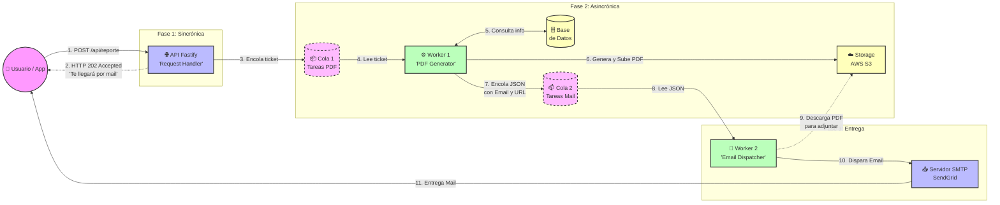

# 🏗️ Evolución de la Arquitectura (Escalado Futuro)

Este documento detalla la arquitectura orientada a eventos (Pub/Sub) planificada para el proyecto en caso de requerir un escalado horizontal masivo.

El objetivo es desacoplar la API principal de la generación intensiva de PDFs y el envío de correos, utilizando colas de mensajes para garantizar que ninguna petición se pierda y el servidor no se sature.

